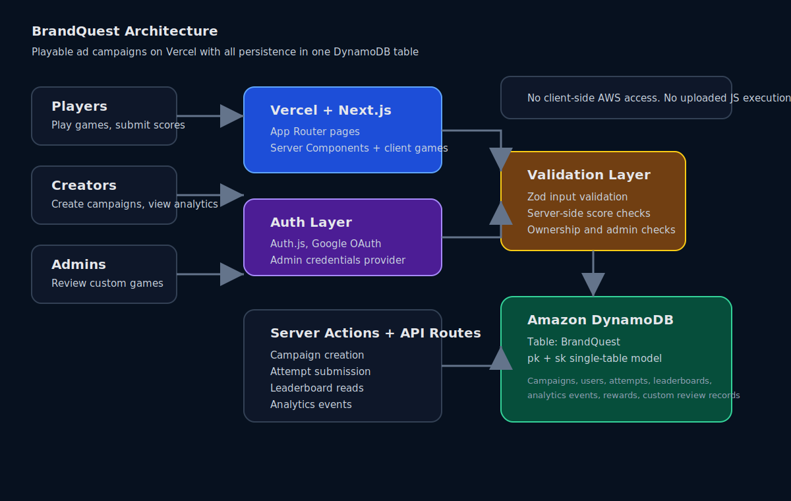
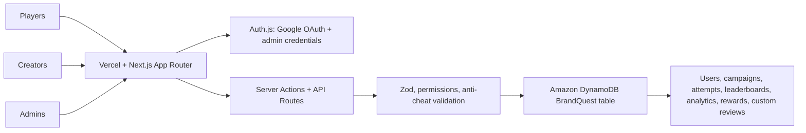

# BrandQuest

Playable ads. Real rewards.

BrandQuest is a full-stack playable-ads platform for the H0 Vercel + AWS
Databases hackathon. Brands launch mini-game campaigns with rewards, players
compete on server-validated leaderboards, and creators get measurable
engagement analytics instead of passive ad impressions.

Production: <https://brandquest-playable-ads.vercel.app>

## Why It Matters

Most digital ads measure impressions and clicks. BrandQuest measures active
participation: campaign views, game starts, attempts, validated scores,
leaderboard placement, repeat play, and reward claims. A brand can launch a
campaign, watch real attempts arrive, and see which players completed or
replayed the experience.

## Product Flows

### Player

- Sign in with Google.
- Browse `/player` for live campaigns from DynamoDB.
- Open a campaign and play a built-in game such as Beat Tiles, Brand Quiz,
  Memory Match, Reaction Tap, Word Scramble, Pattern Recall, or Brand Rush
  Runner.
- Submit a score through `POST /api/attempts`.
- See leaderboard position, XP/profile progress, participations, and rewards.

### Creator

- Sign in with Google and choose Creator during onboarding.
- Create campaigns with title, brand, preview title/text, thumbnail, template,
  incentive/prize, attempt limit, start/end dates, and status.
- View only campaigns owned by the signed-in creator.
- View DynamoDB-backed analytics: attempts, unique players, average score, top
  score, funnel, repeat play rate, suspicious attempts, and leaderboard context.
- Submit metadata-only custom games for admin review.

### Admin

- Admin access is separate from normal Google onboarding.
- New users cannot self-select admin.
- Admin credentials are configured with server-side environment variables only.
- Admins approve, reject, or comment on custom-game submissions.
- Rejection reasons are stored and visible to creators.
- Approval maps metadata to a trusted first-party runtime. Uploaded JavaScript
  is never executed.

## Demo Game: Beat Tiles

Beat Tiles is the recommended custom-game demo.

- 4 lanes.
- Keyboard controls: `A S D F` plus arrow-key support.
- Mouse/touch lane tapping.
- Falling music tiles.
- Perfect, Great, and Miss feedback.
- Combo streak and max combo.
- Accuracy metric.
- 45-second visible timer/progress bar.
- Final score submission to the same secure attempt endpoint.

Use `demo-assets/spotify-beat-tiles-custom-game.json` for the video demo. It is
metadata only and requests the trusted Beat Tiles runtime.

## Playable Templates

Fully playable:

- Brand Quiz
- Memory Match
- Reaction Tap
- Word Scramble
- Pattern Recall
- Beat Tiles
- Brand Rush Runner

Roadmap templates remain visible but disabled until their runtime exists. This
prevents creators from publishing broken playable routes.

## Leaderboards and Winning Criteria

Campaigns can carry simple leaderboard metadata:

- `primaryMetric`: `score`, `accuracy`, `completionTime`, or `combo`
- `sortDirection`: `desc` or `asc`
- `tieBreakers`: secondary metrics

Default campaigns rank by score, then earliest submission. Beat Tiles ranks by
score, then accuracy, max combo, and earliest submission. Attempt records store
score, duration, accuracy, hits, misses, and max combo when a game provides
those metrics.

## Custom Game Safety

Custom game submissions are metadata/config only:

- brand name
- game title
- preview copy
- thumbnail URL or safe small image data URL
- desired game style
- reward/incentive
- scoring method and expected score range
- time limit
- instructions and security notes

BrandQuest does not execute arbitrary uploaded JavaScript, run uploaded files,
or trust custom-game client scores. Approved custom games map to trusted
first-party runtimes such as Beat Tiles or Brand Rush Runner.

## Architecture

Detailed diagrams are in `docs/architecture`.





## DynamoDB

BrandQuest uses one existing DynamoDB table. The app does not create AWS
resources.

- Table: `BrandQuest`
- Region: `us-east-1`
- Partition key: `pk`
- Sort key: `sk`

Access patterns:

- `USER#{userId}` / `PROFILE` for user role/profile
- `EMAIL#{email}` / `USER` for email lookup
- `CREATOR#{creatorId}` / `CAMPAIGN#{campaignId}` for creator campaign lists
- `CAMPAIGN#{campaignId}` / `META` for campaign detail
- `CAMPAIGNS#STATUS#live` for player arcade
- `CAMPAIGN#{campaignId}` / `ATTEMPT#...` for attempts and leaderboard reads
- `PLAYER#{playerId}` / `ATTEMPT#...` for player attempt history
- `PLAYER#{playerId}` / `CAMPAIGN#{campaignId}` for participation
- `CAMPAIGN#{campaignId}` / `EVENT#...` for analytics events
- `CUSTOM_REVIEW#{status}` for admin review queues

The MVP aggregates bounded campaign attempts/events for analytics. For larger
scale, the same single-table model can add rollup items and GSIs for
time-windowed leaderboards and analytics.

Amazon DynamoDB is used for high-volume game attempts, leaderboard events,
reward claims, campaign analytics, and player progression.

## Environment Variables

Required for real persistence/auth:

- `USE_DYNAMODB`
- `AWS_REGION`
- `BRANDQUEST_DYNAMODB_TABLE`
- `AWS_ACCESS_KEY_ID`
- `AWS_SECRET_ACCESS_KEY`
- `GOOGLE_CLIENT_ID`
- `GOOGLE_CLIENT_SECRET`
- `AUTH_SECRET`
- `NEXTAUTH_SECRET`
- `NEXTAUTH_URL`

Required for credential-based admin access:

- `ADMIN_EMAIL`
- `ADMIN_PASSWORD_HASH`
- `ADMIN_PASSWORD_SALT`

Never prefix secrets with `NEXT_PUBLIC_`. AWS keys and auth secrets must remain
server-side only.

## Local Development

```bash
pnpm install
npm run typecheck
npm run build
npm run dev
```

Open `http://localhost:3000`.

## Deployment

The app is configured for Vercel. Set the required server-side env vars in
Vercel for Production, Preview, and Development. Do not commit `.env.local`,
`.vercel`, `.next`, `node_modules`, admin credential files, or secret backups.

## Security Choices

- All important inputs are validated with Zod.
- Scores are revalidated server-side.
- Attempt limits, campaign dates, duplicate attempt IDs, and impossible scores
  are checked on the server.
- Campaign ownership and admin access are enforced server-side.
- Role cookies are onboarding hints only, not authorization.
- DynamoDB is selected only when `USE_DYNAMODB=true`; otherwise the app renders
  clean empty states.
- No fake campaign fallback is shown as real platform data.
- No AWS SDK imports are used in client components.
- No arbitrary uploaded custom-game code is executed.
