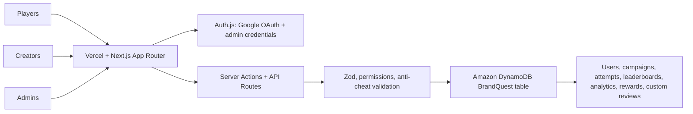
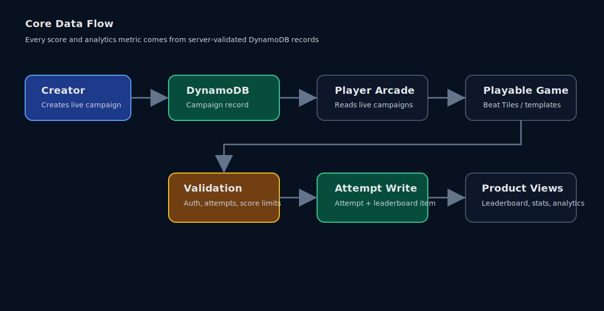
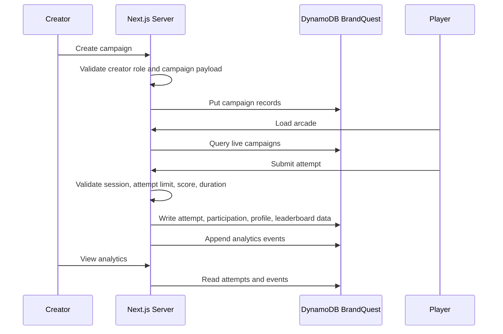
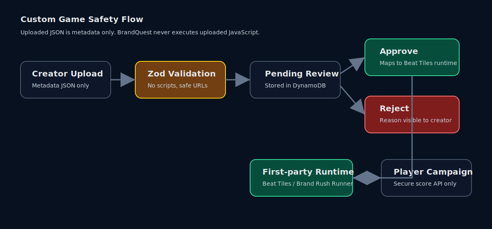
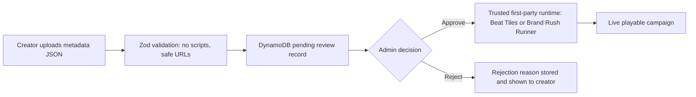

# BrandQuest Architecture

BrandQuest runs as a Vercel-hosted Next.js app with Auth.js, server-side
validation, and one existing Amazon DynamoDB table named `BrandQuest`.

Amazon DynamoDB is used for high-volume game attempts, leaderboard events,
reward claims, campaign analytics, and player progression.

## System Architecture

## Core Data Flow

## Custom Game Safety

## DynamoDB Single-table Access Patterns

- `USER#{userId}` / `PROFILE` stores user role and profile.
- `EMAIL#{email}` / `USER` supports Auth.js email lookup.
- `CREATOR#{creatorId}` / `CAMPAIGN#{campaignId}` lists creator campaigns.
- `CAMPAIGN#{campaignId}` / `META` reads campaign detail.
- `CAMPAIGNS#STATUS#live` lists player arcade campaigns.
- `CAMPAIGN#{campaignId}` / `ATTEMPT#...` stores campaign attempts.
- `PLAYER#{playerId}` / `ATTEMPT#...` stores player attempt history.
- `PLAYER#{playerId}` / `CAMPAIGN#{campaignId}` stores participation.
- `CAMPAIGN#{campaignId}` / `EVENT#...` stores analytics events.
- `CUSTOM_REVIEW#{status}` lists custom-game review queues.

The hackathon MVP reads bounded campaign attempts/events for analytics. At
larger scale, the same table can add rollup items and GSIs for time-windowed
leaderboards and analytics without changing the app contract.

## Safety Notes

- AWS SDK imports are server-only.
- No client component imports DynamoDB.
- Scores are never trusted client-side.
- Uploaded custom-game JSON is metadata only.
- Approved custom games map to trusted app code; no uploaded JavaScript runs.
- The app does not create AWS resources automatically.
